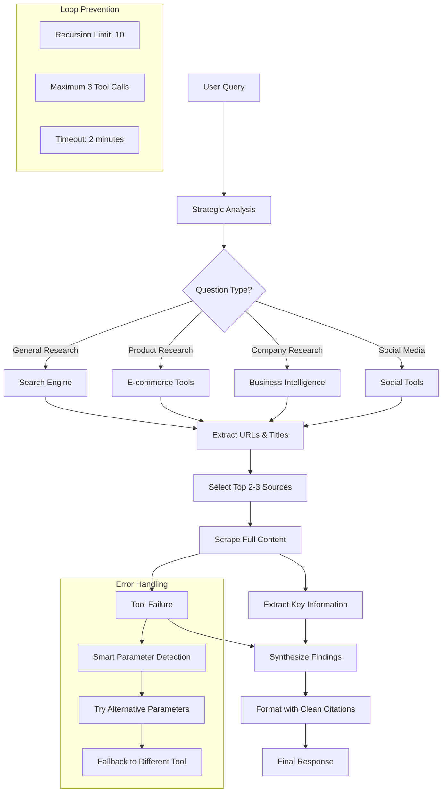

# 🔍 Advanced Research Agent with MCP Integration

An AI-powered research assistant built with **LangGraph**, **Google Gemini**, and **Model Control Protocol (MCP)** that provides comprehensive, multi-source research with clean citations.

## 🚀 Overview

This advanced research agent thinks strategically about which tools to use in sequence, scrapes content from multiple sources, and provides detailed responses with proper source citations formatted as clean, clickable flags.

## ✨ Key Features

- **🧠 Strategic Planning**: Analyzes questions and plans optimal tool sequences
- **🔗 Multi-Source Research**: Combines search, scraping, and extraction tools
- **📚 Clean Citations**: Professional source formatting with clickable flags
- **⚡ 60+ Specialized Tools**: Comprehensive data collection capabilities
- **🛡️ Error Recovery**: Smart parameter detection and fallback mechanisms
- **🔄 Loop Prevention**: Built-in recursion limits and efficiency controls

## 🛠️ Technology Stack

- **Agent Framework**: LangGraph with `create_react_agent`
- **LLM**: Google Gemini 2.5 Flash
- **Protocol**: Model Control Protocol (MCP)
- **UI**: Chainlit for interactive chat interface
- **Data Source**: Bright Data MCP server (60+ tools)

## 📋 Available Tool Categories

### **Core Research Tools**
- **Search Engine**: Google, Bing, Yandex SERP results
- **Content Scraping**: Markdown/HTML extraction with bot bypass
- **Data Extraction**: AI-powered structured data conversion

### **E-commerce Intelligence**
- Amazon, eBay, Walmart, Zara, Etsy, BestBuy
- Product data, reviews, pricing, search results

### **Social Media & Content**
- LinkedIn, Instagram, Facebook, TikTok, Twitter/X, YouTube
- Profiles, posts, comments, engagement data

### **Business Intelligence**
- Crunchbase company profiles
- ZoomInfo business data
- LinkedIn company insights

### **News & Finance**
- Reuters news articles
- Yahoo Finance business data
- Market information

### **Specialized Data**
- Zillow real estate listings
- Google/Apple app store data
- Google Maps reviews
- Interactive browser automation

## 🔄 Agent Workflow



## 🎯 Response Format

The agent provides structured responses with clean source citations:

```markdown
## Research Topic

**Summary**: Brief answer to the question

**Key Findings**:
- According to [Apple](https://apple.com), specific information
- [Best Buy](https://bestbuy.com) shows customer feedback data
- [Amazon](https://amazon.com) reviews indicate performance metrics

**Additional Details**:
- Detailed analysis with evidence
- Direct quotes from sources
- Contextual information

**Sources**: [Apple](https://apple.com) | [Best Buy](https://bestbuy.com) | [Amazon](https://amazon.com)
```

## 🚀 Getting Started

### Prerequisites

## 🛠️ Commands

### Virtual Environment Commands

```bash
# Create virtual environment
python -m venv venv
# Activate virtual environment
source venv/bin/activate    # macOS/Linux
# venv\Scripts\activate     # Windows

# Deactivate when done
deactivate

# Check if venv is active
which python                # Should show venv path
```
### Package Installation


```bash
pip install -r requirements.txt
```

### Environment Setup

Create a \`.env\` file:

```env
# Google Gemini API Key (Required)
GOOGLE_API_KEY=your_gemini_api_key_here

# Bright Data MCP (Optional - for enhanced tools)
BRIGHTDATA_API_TOKEN=your_brightdata_token_here
```

### Running the Agent

```bash
# Clone the repository
git clone <repository-url>
cd advanced-research-agent

# Install dependencies
pip install -r requirements.txt

# Run the agent
chainlit run agent.py -w
```

### Connecting MCP Server

1. **Start the application**
2. **Click "Add MCP"** in the sidebar
3. **Configure Bright Data MCP**:
   - **Name**: \`Bright_data\`
   - **Type**: \`stdio\`
   - **Command**: \`API_TOKEN=your_brightdata_token_here npx @brightdata/mcp\`
4. **Start researching!**

## 📊 Tool Usage Examples

### **Product Research**
```
User: "Find reviews and pricing for iPhone 15 Pro"

Agent Process:
1. search_engine → Find review sites and retailers
2. scrape_as_markdown → Apple official specs
3. web_data_bestbuy_products → Pricing and reviews
4. web_data_amazon_product → Additional reviews
```

### **Company Research**
```
User: "Research Tesla's Q4 2024 financial performance"

Agent Process:
1. search_engine → Find financial reports
2. web_data_yahoo_finance_business → Stock data
3. scrape_as_markdown → Official earnings report
4. web_data_reuters_news → Market analysis
```

### **Technology Updates**
```
User: "What are the latest updates about Qwen LLM?"

Agent Process:
1. search_engine → Find recent announcements
2. scrape_as_markdown → Official blog posts
3. web_data_github_repository_file → Repository updates
4. Extract → Key features and changes
```

## 🛡️ Error Handling & Recovery

### **Smart Parameter Detection**
- Automatically detects URL inputs for scraping tools
- Maps tool names to appropriate parameter formats
- Fallback parameter combinations for failed calls

### **Loop Prevention**
- **Recursion Limit**: 10 iterations maximum
- **Tool Call Limit**: Maximum 3 calls per question
- **Timeout Protection**: 2-minute research limit
- **Instruction-Based**: Clear guidance to avoid repetition

### **Parameter Mapping**
```python
# URL Detection
if input.startswith('http'):
    params = {"url": input}  # For scraping tools

# Tool-Specific
search_engine → {"query": input}
extract → {"content": input}
web_data_* → {"url": input}
```

## 🔧 Configuration Options

### **Agent Parameters**
- **Temperature**: 0.2 (balanced for research accuracy)
- **Max Tokens**: 8192 (detailed responses)
- **Recursion Limit**: 10 (loop prevention)
- **Timeout**: 120 seconds (comprehensive research)

### **Tool Configuration**
- **60+ Specialized Tools**: Bright Data MCP server
- **Smart Parameter Detection**: Automatic format detection
- **Error Recovery**: Multiple fallback mechanisms
- **Clean Citations**: Professional source formatting

## 📈 Performance Features

- **Efficient Research**: Strategic tool planning reduces unnecessary calls
- **Clean UI**: Simplified interface with detailed capabilities in welcome screen
- **Professional Output**: Markdown formatting with clickable source flags
- **Error Resilience**: Multiple fallback mechanisms for reliable operation

## 🤝 Contributing

1. Fork the repository
2. Create a feature branch (\`git checkout -b feature/amazing-feature\`)
3. Commit changes (\`git commit -m 'Add amazing feature'\`)
4. Push to branch (\`git push origin feature/amazing-feature\`)
5. Open a Pull Request

## 📝 License

This project is licensed under the MIT License - see the LICENSE file for details.

## 🙏 Acknowledgments

- **LangGraph**: For the reactive agent framework
- **Google Gemini**: For advanced language model capabilities
- **Bright Data**: For comprehensive web scraping tools
- **Chainlit**: For the interactive chat interface
- **Model Control Protocol**: For tool integration standards

## 👥 Demo Video

### 1. Direct Link (Recommended for GitHub)

[](https://vimeo.com/1103491664)


---

Built with ❤️ for comprehensive AI-powered research