```mermaid
graph TB
    %% User Input Layer
    User[👤 User Input] --> Agent{🤖 Deep Research Agent}
    
    %% Main Agent Decision Point
    Agent --> CheckInput{Input Type?}
    CheckInput -->|Normal Question| GeneratePlan[📋 Generate Research Plan]
    CheckInput -->|FOLLOW_UP:| HandleFollowUp[🔄 Handle Follow-up Research]
    
    %% Research Plan Generation
    GeneratePlan --> AnalyzeComplexity[🔍 Analyze Question Complexity]
    AnalyzeComplexity --> ComplexityLevel{Complexity Level}
    ComplexityLevel -->|Basic| BasicPlan[📝 Basic Research Plan]
    ComplexityLevel -->|Intermediate| IntermediatePlan[📝 Intermediate Research Plan]
    ComplexityLevel -->|Comprehensive| ComprehensivePlan[📝 Comprehensive Research Plan]
    
    BasicPlan --> CreateSubQuestions[❓ Create 3-5 Sub-questions]
    IntermediatePlan --> CreateSubQuestions
    ComprehensivePlan --> CreateSubQuestions
    
    CreateSubQuestions --> LLMPlanning[🧠 LLM Generate Strategic Questions]
    LLMPlanning -->|Success| ResearchPlan[📊 Research Plan Created]
    LLMPlanning -->|Fallback| TopicSpecificPlan[📋 Topic-Specific Fallback Plan]
    
    %% Research Execution Phase
    ResearchPlan --> ExecuteResearch[🚀 Execute Research Loop]
    TopicSpecificPlan --> ExecuteResearch
    
    ExecuteResearch --> ResearchQuestion[🔬 Research Sub-question]
    
    %% MCP Tools Integration
    ResearchQuestion --> MCPConnection[🔌 MCP Stdio Connection]
    MCPConnection --> ToolsAvailable{Tools Available?}
    
    ToolsAvailable -->|Yes| LoadTools[🛠️ Load MCP Research Tools]
    ToolsAvailable -->|No| FallbackResearch[📚 Fallback to LLM Knowledge]
    
    %% Research Tools
    LoadTools --> SearchEngine[🔍 search_engine<br/>Google/Bing/Yandex]
    LoadTools --> ScrapeMarkdown[📄 scrape_as_markdown<br/>Extract content]
    LoadTools --> ScrapeHTML[🌐 scrape_as_html<br/>Raw HTML content]
    LoadTools --> ExtractTool[🗂️ extract<br/>Structured JSON data]
    
    %% Research Workflow
    SearchEngine --> ReactAgent[🤖 LangGraph React Agent]
    ScrapeMarkdown --> ReactAgent
    ScrapeHTML --> ReactAgent
    ExtractTool --> ReactAgent
    
    ReactAgent --> ResearchPrompt[📝 Strategic Research Prompt]
    ResearchPrompt --> ToolExecution[⚙️ Tool Execution]
    ToolExecution --> SourceExtraction[📚 Extract Sources & Citations]
    SourceExtraction --> QualityAssessment[⭐ Assess Research Quality]
    
    %% Quality Control
    QualityAssessment --> CitationCheck{Proper Citations?}
    CitationCheck -->|No| AddCitations[➕ Add Missing Citations]
    CitationCheck -->|Yes| CompletenessCheck{Research Complete?}
    AddCitations --> CompletenessCheck
    
    CompletenessCheck -->|Complete| AnswerComplete[✅ Answer Complete]
    CompletenessCheck -->|Needs Follow-up| MarkFollowUp[🔄 Mark for Follow-up]
    
    AnswerComplete --> NextQuestion{More Questions?}
    MarkFollowUp --> NextQuestion
    FallbackResearch --> NextQuestion
    
    NextQuestion -->|Yes| ResearchQuestion
    NextQuestion -->|No| AllQuestionsComplete[🎯 All Questions Researched]
    
    %% Report Generation
    AllQuestionsComplete --> GenerateFollowUps[💡 Generate Follow-up Questions]
    GenerateFollowUps --> CompileFinalReport[📋 Compile Final Report]
    
    %% Final Report Structure
    CompileFinalReport --> ReportSections[📄 Report Sections]
    ReportSections --> ExecutiveSummary[📊 Executive Summary]
    ReportSections --> DetailedFindings[🔍 Detailed Findings]
    ReportSections --> SourceBibliography[📚 Source Bibliography]
    ReportSections --> FollowUpSuggestions[🤔 Follow-up Suggestions]
    ReportSections --> ResearchMetadata[📈 Research Metadata]
    
    %% Follow-up Handling
    HandleFollowUp --> NewResearchPlan[📋 New Research Plan]
    NewResearchPlan --> ExecuteResearch
    
    %% Output
    ExecutiveSummary --> FinalOutput[📤 Final Research Report]
    DetailedFindings --> FinalOutput
    SourceBibliography --> FinalOutput
    FollowUpSuggestions --> FinalOutput
    ResearchMetadata --> FinalOutput
    
    FinalOutput --> User
    
    %% Data Structures (shown as separate components)
    subgraph "📊 Data Structures"
        ResearchQuestionStruct[ResearchQuestion<br/>- question: str<br/>- priority: int<br/>- answered: bool<br/>- answer: str<br/>- sources: list of strings<br/>- follow_up_needed: bool]
        
        ResearchPlanStruct[ResearchPlan<br/>- main_question: str<br/>- sub_questions: list of ResearchQuestion<br/>- research_depth: str<br/>- estimated_time: int<br/>- current_step: int<br/>- completed: bool<br/>- follow_up_questions: list of strings]
    end
    
    %% Configuration
    subgraph "⚙️ Configuration"
        EnvVars[🔐 Environment Variables<br/>- GOOGLE_API_KEY<br/>- BRIGHTDATA_API_TOKEN<br/>- BROWSER_AUTH<br/>- WEB_UNLOCKER_ZONE]
        
        ModelConfig[🧠 Model Configuration<br/>- ChatGoogleGenerativeAI<br/>- gemini-2.5-pro<br/>- temperature: 0.1]
        
        MCPConfig[🔌 MCP Configuration<br/>- StdioServerParameters<br/>- @brightdata/mcp<br/>- timeout: 30.0s]
    end
    
    %% Quality Metrics
    subgraph "📈 Quality Assessment"
        QualityMetrics[Quality Indicators<br/>- has_statistics<br/>- has_recent_info<br/>- has_multiple_sources<br/>- sufficient_length<br/>- has_specific_examples<br/>- addresses_question]
        
        QualityScore[Quality Score<br/>- Source count<br/>- URL presence<br/>- Answer length<br/>- Citation quality<br/>- 0-10 scale]
    end
    
    %% Error Handling
    subgraph "🚨 Error Handling"
        ErrorTypes[Error Types<br/>- Tool connection failures<br/>- API timeouts<br/>- JSON parsing errors<br/>- Source extraction failures]
        
        FallbackStrategies[Fallback Strategies<br/>- Knowledge-based research<br/>- Topic-specific templates<br/>- Generic question patterns<br/>- Error reporting]
    end
    
    %% Styling
    classDef userClass fill:#e1f5fe,stroke:#01579b,stroke-width:2px
    classDef agentClass fill:#f3e5f5,stroke:#4a148c,stroke-width:2px
    classDef toolClass fill:#e8f5e8,stroke:#1b5e20,stroke-width:2px
    classDef dataClass fill:#fff3e0,stroke:#e65100,stroke-width:2px
    classDef outputClass fill:#fce4ec,stroke:#880e4f,stroke-width:2px
    
    class User userClass
    class Agent,ReactAgent agentClass
    class SearchEngine,ScrapeMarkdown,ScrapeHTML,ExtractTool toolClass
    class ResearchQuestionStruct,ResearchPlanStruct dataClass
    class FinalOutput outputClass
```

# Deep Research Agent with Enhanced Citations & Web Search

A powerful AI research assistant built with Chainlit that conducts comprehensive investigations using real-time web search with proper source citations and transparent methodology.



## 🌟 Key Features

### 🌐 Real-time Web Research

- **Live Web Search**: Google, Bing, Yandex integration via BrightData MCP
- **Content Scraping**: Extract detailed content from authoritative sources  
- **Current Information**: Access latest developments with timestamps

### 📚 Enhanced Citations

- **Proper Source Formatting**: URLs with titles and access dates
- **Source Validation**: Verify web vs knowledge-based sources
- **Citation Quality**: Clear distinction between research methods

### 🔍 Research Methodology

- **Strategic Planning**: Break complex questions into focused sub-questions
- **Quality Scoring**: Transparent research quality metrics
- **Method Transparency**: Clear indication of research approach used

### 💡 Intelligence Features

- **Smart Follow-ups**: Generate relevant follow-up questions
- **Progress Tracking**: Real-time research progress indicators
- **Error Handling**: Comprehensive troubleshooting guidance

## 📁 Project Structure

```text
LangGraph_Deep_Research_Agent_MCP/
├── app.py                     # Main Chainlit application
├── agents/
│   └── research_agent.py      # Core research agent implementation
├── config/
│   └── settings.py           # Configuration management
├── utils/
│   └── helpers.py            # Utility functions
├── tests/
│   ├── test_environment.py   # Environment testing
│   └── test_citations.py     # Citation testing
├── docs/
│   ├── FIXES_README.md       # Detailed fixes documentation
│   └── README_detailed.md    # Detailed documentation with mermaid
├── src/
│   └── agent.py             # Legacy agent (kept for compatibility)
├── .env.example             # Environment configuration template
├── requirements.txt         # Python dependencies
├── setup.sh                # Automated setup script
└── chainlit.md             # Chainlit configuration
```

## 🚀 Quick Start

### 1. Create Virtual Environment (Recommended)

**Why use virtual environment?** Isolates project dependencies and prevents conflicts with other Python projects.

```bash
# Clone or navigate to project
cd LangGraph_Deep_Research_Agent_MCP

# Create virtual environment
python -m venv venv

# Activate virtual environment
# On macOS/Linux:
source venv/bin/activate

# On Windows:
# venv\Scripts\activate

# Verify activation (should show venv path)
which python
```

**Important**: Always activate the virtual environment before working with the project:

```bash
# Every time you open a new terminal session:
source venv/bin/activate  # macOS/Linux
# venv\Scripts\activate   # Windows
```

### 2. Install Dependencies

```bash
# Ensure virtual environment is activated
pip install --upgrade pip

# Install required packages
pip install -r requirements.txt

# Copy environment template
cp .env.example .env
```

**Alternative - Automated Setup:**

```bash
# Use setup script (includes venv creation)
chmod +x setup.sh
./setup.sh
```

### 3. Configure API Keys

Edit `.env` file:

```bash
# Required - Get from Google AI Studio
GOOGLE_API_KEY=your_google_api_key_here
GOOGLE_MODEL=gemini-2.0-flash-exp

# Optional - Get from BrightData for web research
BRIGHTDATA_API_TOKEN=your_brightdata_token_here
BROWSER_AUTH=your_browser_auth_here
WEB_UNLOCKER_ZONE=map_web_unlocker
```

### 4. Test Configuration

```bash
# Test your setup (ensure venv is activated)
python tests/test_environment.py

# Test citation functionality
python tests/test_citations.py
```

### 5. Run Application

```bash
# Start the research agent (ensure venv is activated)
chainlit run app.py
```

**Virtual Environment Reminder**: Always ensure your virtual environment is activated before running any commands. You should see `(venv)` at the beginning of your terminal prompt.

## 📊 Research Modes

### 🌐 Web Research Mode (Recommended)

**Requirements**: `GOOGLE_API_KEY` + `BRIGHTDATA_API_TOKEN`

- Real-time web search and content scraping
- Current information with proper source citations
- Live data from authoritative sources

### 📚 Knowledge-Based Mode (Fallback)

**Requirements**: `GOOGLE_API_KEY` only

- Analysis based on training data
- Clear labeling of limitations
- Recommendations for web research setup

## 🔧 API Key Setup

### Google API Key (Required)

1. Visit [Google AI Studio](https://makersuite.google.com/app/apikey)
2. Create new API key
3. Add to `.env` as `GOOGLE_API_KEY=your_key_here`

### BrightData Token (Optional, for Web Research)

1. Sign up at [BrightData](https://brightdata.com/)
2. Get API token from dashboard
3. Add to `.env` as `BRIGHTDATA_API_TOKEN=your_token_here`

## 🎯 Usage Examples

### Technology Research

```text
"What are the latest developments in AI safety regulations in 2024?"
"Compare current large language model capabilities and limitations"
"Analyze recent advances in quantum computing applications"
```

### Business Analysis

```text  
"Impact of remote work on tech industry productivity metrics"
"Renewable energy adoption rates and market trends globally"
"Cryptocurrency regulation changes across major markets"
```

### Science & Health

```text
"Recent breakthroughs in cancer immunotherapy research"
"Climate change mitigation strategies and their effectiveness"
"Mental health trends and interventions post-pandemic"
```

## 🛠️ Commands

### Virtual Environment Commands

```bash
# Activate virtual environment
source venv/bin/activate    # macOS/Linux
# venv\Scripts\activate     # Windows

# Deactivate when done
deactivate

# Check if venv is active
which python                # Should show venv path
```

### In-App Commands

- **Ask any question** - Start comprehensive research
- **Type number** (1-5) - Select follow-up question
- **help** - Show usage instructions
- **status** - Check configuration and environment

### Terminal Commands

```bash
# Test environment (venv must be active)
python tests/test_environment.py

# Test specific features
python tests/test_citations.py

# Start application
chainlit run app.py
```

## 📈 Research Quality Features

### Citation Quality

- ✅ **Web Sources**: Direct URLs with titles and access dates
- ✅ **Source Validation**: Verify authenticity and relevance
- ✅ **Method Transparency**: Clear indication of research approach

### Research Methodology

- ✅ **Strategic Planning**: Break complex questions into sub-questions
- ✅ **Quality Scoring**: Quantitative research quality metrics
- ✅ **Progress Tracking**: Real-time research progress indicators
- ✅ **Error Handling**: Comprehensive troubleshooting guidance

## 🔍 Troubleshooting

### Virtual Environment Issues

#### Virtual Environment Not Activated

**Symptoms**: `ModuleNotFoundError` or wrong Python version

**Solution**:

```bash
# Activate virtual environment
source venv/bin/activate  # macOS/Linux
# venv\Scripts\activate   # Windows

# Verify activation
which python
```

#### Package Installation Errors

**Symptoms**: Permission errors or package conflicts

**Solution**:

```bash
# Ensure venv is active, then:
pip install --upgrade pip
pip install -r requirements.txt --force-reinstall
```

### Common Issues

#### No Web Research

**Symptoms**: Only knowledge-based responses

**Solution**:

1. Check `BRIGHTDATA_API_TOKEN` in `.env`
2. Verify Node.js installation: `npx --version`
3. Test connection: `python tests/test_citations.py`

#### Poor Citations

**Symptoms**: Missing or improperly formatted sources

**Solution**:

1. Ensure using organized app structure
2. Verify web research is working (check status)
3. Update to latest version of dependencies

#### Environment Issues

**Symptoms**: Import errors, API failures

**Solution**:

1. Activate virtual environment: `source venv/bin/activate`
2. Run: `python tests/test_environment.py`
3. Check: `.env` file configuration
4. Reinstall: `pip install -r requirements.txt`

### Getting Help

- Run `python tests/test_environment.py` for diagnostics
- Check configuration with in-app **status** command
- Review `docs/FIXES_README.md` for detailed troubleshooting

## 📋 Requirements

### System Requirements

- Python 3.8+
- Node.js (for MCP web research tools)
- Internet connection
- Virtual environment (recommended)

### Python Dependencies

- chainlit >= 1.0.0
- langchain-google-genai
- langgraph
- langchain-mcp-adapters
- mcp
- python-dotenv
- pydantic >= 2.0.0

## 🔄 Version History

### v3.0 (Current)

- ✅ Organized project structure
- ✅ Enhanced citation system
- ✅ Real-time web research validation
- ✅ Comprehensive error handling
- ✅ Method transparency
- ✅ Virtual environment setup guide

### v2.1 (Previous)

- ✅ Improved source extraction
- ✅ Better fallback handling
- ✅ Enhanced user feedback

### v1.0 (Original)

- ✅ Basic research functionality
- ✅ Simple citation system
- ✅ Chainlit interface

## 📄 License

This project is licensed under the MIT License - see the LICENSE file for details.

## 🤝 Contributing

Contributions are welcome! Please:

1. Fork the repository
2. Create a virtual environment: `python -m venv venv`
3. Activate it: `source venv/bin/activate`
4. Create a feature branch
5. Submit a pull request with detailed description

## 📞 Support

For issues and questions:

1. Check virtual environment is activated: `which python`
2. Check `docs/FIXES_README.md` for detailed troubleshooting
3. Run diagnostic tests: `python tests/test_environment.py`
4. Submit issues with configuration details and error logs

---

**Ready to start researching?**

1. Create and activate virtual environment
2. Configure your API keys
3. Run `chainlit run app.py`
