# Deep Research Agent WIth Bright Data MCP 

A powerful AI research assistant built with Chainlit that conducts comprehensive investigations on any topic using advanced web search and analysis capabilities.

```mermaid
graph TB
    %% User Input Layer
    User[👤 User Input] --> Agent{🤖 Deep Research Agent}
    
    %% Main Agent Decision Point
    Agent --> CheckInput{Input Type?}
    CheckInput -->|Normal Question| GeneratePlan[📋 Generate Research Plan]
    CheckInput -->|FOLLOW_UP:| HandleFollowUp[🔄 Handle Follow-up Research]
    
    %% Research Plan Generation
    GeneratePlan --> AnalyzeComplexity[🔍 Analyze Question Complexity]
    AnalyzeComplexity --> ComplexityLevel{Complexity Level}
    ComplexityLevel -->|Basic| BasicPlan[📝 Basic Research Plan]
    ComplexityLevel -->|Intermediate| IntermediatePlan[📝 Intermediate Research Plan]
    ComplexityLevel -->|Comprehensive| ComprehensivePlan[📝 Comprehensive Research Plan]
    
    BasicPlan --> CreateSubQuestions[❓ Create 3-5 Sub-questions]
    IntermediatePlan --> CreateSubQuestions
    ComprehensivePlan --> CreateSubQuestions
    
    CreateSubQuestions --> LLMPlanning[🧠 LLM Generate Strategic Questions]
    LLMPlanning -->|Success| ResearchPlan[📊 Research Plan Created]
    LLMPlanning -->|Fallback| TopicSpecificPlan[📋 Topic-Specific Fallback Plan]
    
    %% Research Execution Phase
    ResearchPlan --> ExecuteResearch[🚀 Execute Research Loop]
    TopicSpecificPlan --> ExecuteResearch
    
    ExecuteResearch --> ResearchQuestion[🔬 Research Sub-question]
    
    %% MCP Tools Integration
    ResearchQuestion --> MCPConnection[🔌 MCP Stdio Connection]
    MCPConnection --> ToolsAvailable{Tools Available?}
    
    ToolsAvailable -->|Yes| LoadTools[🛠️ Load MCP Research Tools]
    ToolsAvailable -->|No| FallbackResearch[📚 Fallback to LLM Knowledge]
    
    %% Research Tools
    LoadTools --> SearchEngine[🔍 search_engine<br/>Google/Bing/Yandex]
    LoadTools --> ScrapeMarkdown[📄 scrape_as_markdown<br/>Extract content]
    LoadTools --> ScrapeHTML[🌐 scrape_as_html<br/>Raw HTML content]
    LoadTools --> ExtractTool[🗂️ extract<br/>Structured JSON data]
    
    %% Research Workflow
    SearchEngine --> ReactAgent[🤖 LangGraph React Agent]
    ScrapeMarkdown --> ReactAgent
    ScrapeHTML --> ReactAgent
    ExtractTool --> ReactAgent
    
    ReactAgent --> ResearchPrompt[📝 Strategic Research Prompt]
    ResearchPrompt --> ToolExecution[⚙️ Tool Execution]
    ToolExecution --> SourceExtraction[📚 Extract Sources & Citations]
    SourceExtraction --> QualityAssessment[⭐ Assess Research Quality]
    
    %% Quality Control
    QualityAssessment --> CitationCheck{Proper Citations?}
    CitationCheck -->|No| AddCitations[➕ Add Missing Citations]
    CitationCheck -->|Yes| CompletenessCheck{Research Complete?}
    AddCitations --> CompletenessCheck
    
    CompletenessCheck -->|Complete| AnswerComplete[✅ Answer Complete]
    CompletenessCheck -->|Needs Follow-up| MarkFollowUp[🔄 Mark for Follow-up]
    
    AnswerComplete --> NextQuestion{More Questions?}
    MarkFollowUp --> NextQuestion
    FallbackResearch --> NextQuestion
    
    NextQuestion -->|Yes| ResearchQuestion
    NextQuestion -->|No| AllQuestionsComplete[🎯 All Questions Researched]
    
    %% Report Generation
    AllQuestionsComplete --> GenerateFollowUps[💡 Generate Follow-up Questions]
    GenerateFollowUps --> CompileFinalReport[📋 Compile Final Report]
    
    %% Final Report Structure
    CompileFinalReport --> ReportSections[📄 Report Sections]
    ReportSections --> ExecutiveSummary[📊 Executive Summary]
    ReportSections --> DetailedFindings[🔍 Detailed Findings]
    ReportSections --> SourceBibliography[📚 Source Bibliography]
    ReportSections --> FollowUpSuggestions[🤔 Follow-up Suggestions]
    ReportSections --> ResearchMetadata[📈 Research Metadata]
    
    %% Follow-up Handling
    HandleFollowUp --> NewResearchPlan[📋 New Research Plan]
    NewResearchPlan --> ExecuteResearch
    
    %% Output
    ExecutiveSummary --> FinalOutput[📤 Final Research Report]
    DetailedFindings --> FinalOutput
    SourceBibliography --> FinalOutput
    FollowUpSuggestions --> FinalOutput
    ResearchMetadata --> FinalOutput
    
    FinalOutput --> User
    
    %% Data Structures (shown as separate components)
    subgraph "📊 Data Structures"
        ResearchQuestionStruct[ResearchQuestion<br/>- question: str<br/>- priority: int<br/>- answered: bool<br/>- answer: str<br/>- sources: list of strings<br/>- follow_up_needed: bool]
        
        ResearchPlanStruct[ResearchPlan<br/>- main_question: str<br/>- sub_questions: list of ResearchQuestion<br/>- research_depth: str<br/>- estimated_time: int<br/>- current_step: int<br/>- completed: bool<br/>- follow_up_questions: list of strings]
    end
    
    %% Configuration
    subgraph "⚙️ Configuration"
        EnvVars[🔐 Environment Variables<br/>- GOOGLE_API_KEY<br/>- BRIGHTDATA_API_TOKEN<br/>- BROWSER_AUTH<br/>- WEB_UNLOCKER_ZONE]
        
        ModelConfig[🧠 Model Configuration<br/>- ChatGoogleGenerativeAI<br/>- gemini-2.5-pro<br/>- temperature: 0.1]
        
        MCPConfig[🔌 MCP Configuration<br/>- StdioServerParameters<br/>- @brightdata/mcp<br/>- timeout: 30.0s]
    end
    
    %% Quality Metrics
    subgraph "📈 Quality Assessment"
        QualityMetrics[Quality Indicators<br/>- has_statistics<br/>- has_recent_info<br/>- has_multiple_sources<br/>- sufficient_length<br/>- has_specific_examples<br/>- addresses_question]
        
        QualityScore[Quality Score<br/>- Source count<br/>- URL presence<br/>- Answer length<br/>- Citation quality<br/>- 0-10 scale]
    end
    
    %% Error Handling
    subgraph "🚨 Error Handling"
        ErrorTypes[Error Types<br/>- Tool connection failures<br/>- API timeouts<br/>- JSON parsing errors<br/>- Source extraction failures]
        
        FallbackStrategies[Fallback Strategies<br/>- Knowledge-based research<br/>- Topic-specific templates<br/>- Generic question patterns<br/>- Error reporting]
    end
    
    %% Styling
    classDef userClass fill:#e1f5fe,stroke:#01579b,stroke-width:2px
    classDef agentClass fill:#f3e5f5,stroke:#4a148c,stroke-width:2px
    classDef toolClass fill:#e8f5e8,stroke:#1b5e20,stroke-width:2px
    classDef dataClass fill:#fff3e0,stroke:#e65100,stroke-width:2px
    classDef outputClass fill:#fce4ec,stroke:#880e4f,stroke-width:2px
    
    class User userClass
    class Agent,ReactAgent agentClass
    class SearchEngine,ScrapeMarkdown,ScrapeHTML,ExtractTool toolClass
    class ResearchQuestionStruct,ResearchPlanStruct dataClass
    class FinalOutput outputClass
```


## Features

🔍 **Deep Research Capabilities**
- Multi-step research planning
- Strategic sub-question breakdown
- Web search and content scraping
- Source citations and references

📊 **Interactive Interface**
- Real-time progress tracking
- Structured research reports
- Follow-up question suggestions
- Action buttons for easy exploration

🎯 **Smart Analysis**
- Automatic complexity assessment
- Intelligent question prioritization
- Comprehensive final reports
- Research metadata tracking

## Quick Start

1. **Install dependencies:**
   ```bash
   pip install -r requirements.txt
   ```

2. **Set up environment variables:**
   Make sure your `.env` file contains:
   ```
   GOOGLE_API_KEY=your_google_api_key
   BRIGHTDATA_API_TOKEN=your_brightdata_token
   # ... other required keys
   ```

3. **Run the Chainlit app:**
   ```bash
   chainlit run app.py
   ```

4. **Open your browser:**
   Navigate to `http://localhost:8000` to start researching!

## How to Use

### Basic Research
Simply ask any research question:
- "What are the latest developments in quantum computing?"
- "Analyze the impact of AI on healthcare"
- "Compare different renewable energy technologies"

### Advanced Features
- **Follow-up Questions**: Click suggested follow-up buttons to dive deeper
- **Progress Tracking**: Watch real-time research progress
- **Structured Reports**: Get comprehensive, well-organized results
- **Source Citations**: All findings include proper source references

### Example Research Flow
1. Ask: "What is the current state of electric vehicle adoption?"
2. Agent generates research plan with sub-questions
3. Conducts web research for each sub-question
4. Compiles comprehensive report with sources
5. Suggests intelligent follow-up questions
6. Click follow-up buttons to explore further

## Configuration

### Research Depth
The agent automatically determines research depth based on question complexity:
- **Basic**: Simple factual questions
- **Intermediate**: Analysis and comparison questions  
- **Comprehensive**: Complex, multi-faceted investigations

### Customization
Edit `app.py` to customize:
- UI messages and formatting
- Progress tracking steps
- Follow-up question handling
- Error messages and fallbacks

## Architecture

- **Frontend**: Chainlit web interface
- **Backend**: Deep Research Agent with LangGraph
- **Search**: BrightData MCP integration
- **LLM**: Google Gemini for analysis and synthesis
- **Tools**: Web search, content scraping, citation extraction

## Troubleshooting

### Common Issues
1. **API Key Errors**: Ensure all required API keys are set in `.env`
2. **Timeout Issues**: Complex research may take time - be patient
3. **Search Failures**: Agent will fallback to knowledge-based responses

### Debug Mode
Set `LOG_LEVEL=DEBUG` in `.env` for detailed logging.

## Contributing

Feel free to enhance the agent by:
- Adding new research tools
- Improving UI/UX
- Extending follow-up question logic
- Adding export functionality

## License

MIT License - feel free to use and modify as needed.